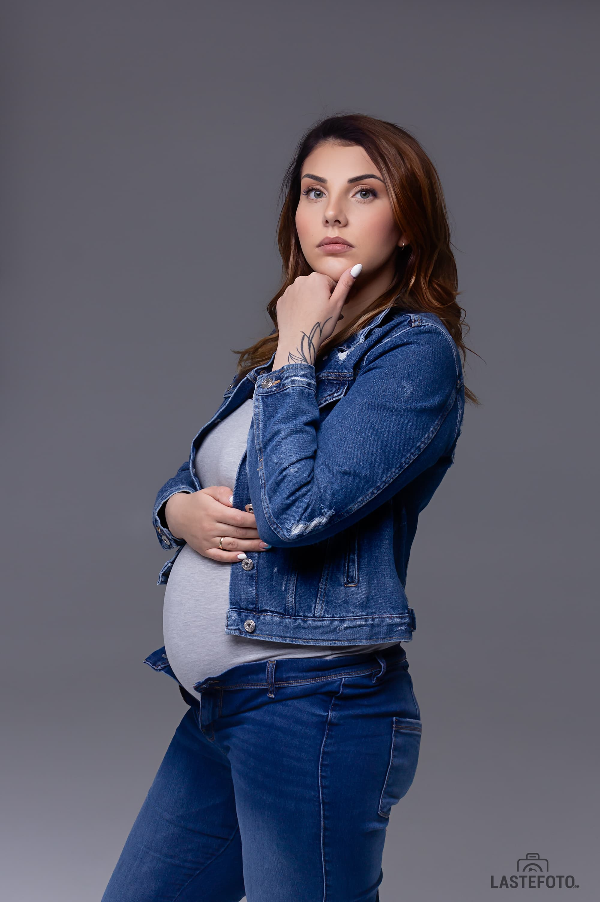

It is ve-e-ery beautiful: only a pregnant woman and her tummy...

## Laconic, stylish ❤️

As I write this, goosebumps are running down my skin: for me, however, photographing pregnancy is special.

And if it is also in an elegant Vogue style, then it's just a delight!

I signed up for online training with the founder of this direction, Sasha Bunaeva! These photos were taken as part of the training.

First homework and first light schemes. I'm happy ❤️

This is exactly the kind of photography that I really enjoy and which I want to develop and offer to future moms. 😍

There are still three homework and a diploma ahead, but now you can book a photo shoot in this direction. If this is your first pregnancy, then I am waiting for you if you are 20 to 27 weeks pregnant.

It will be very cool, I can already feel it! ❤