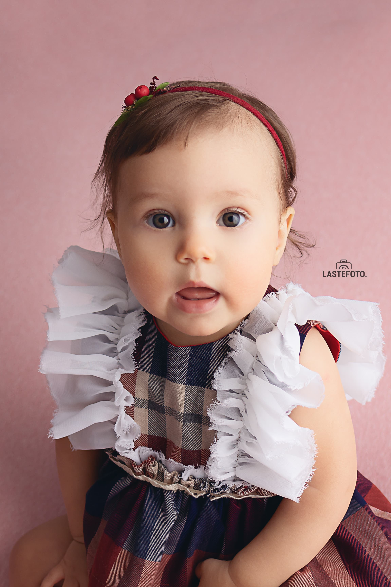
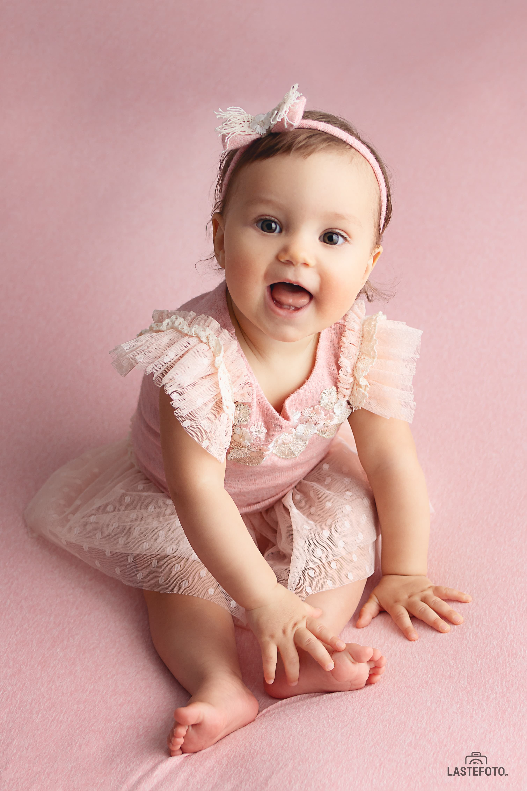



Older kids are frequent guests of my studio. 🥰

Just dive into those eyes! 😍

With grown-up babies in a photoshoot the exact same rule applies as in shooting with newborns -
## calm mom = calm baby

Go to the shooting with a smile and a calm heart (yes, no need to panic), tell your kid where and why you are going, let him see your confidence and good mood!

