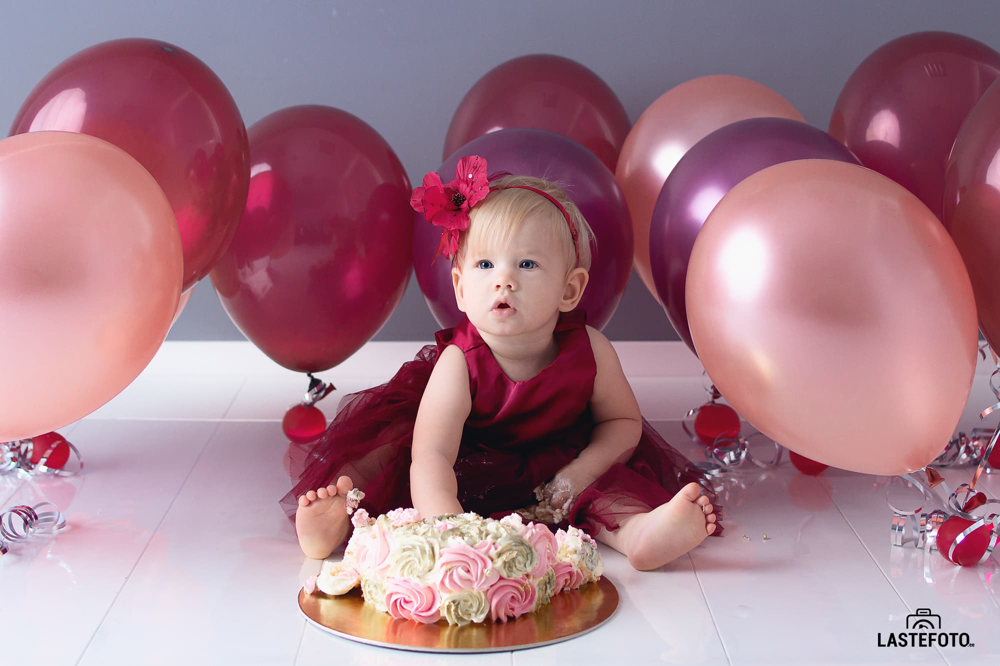
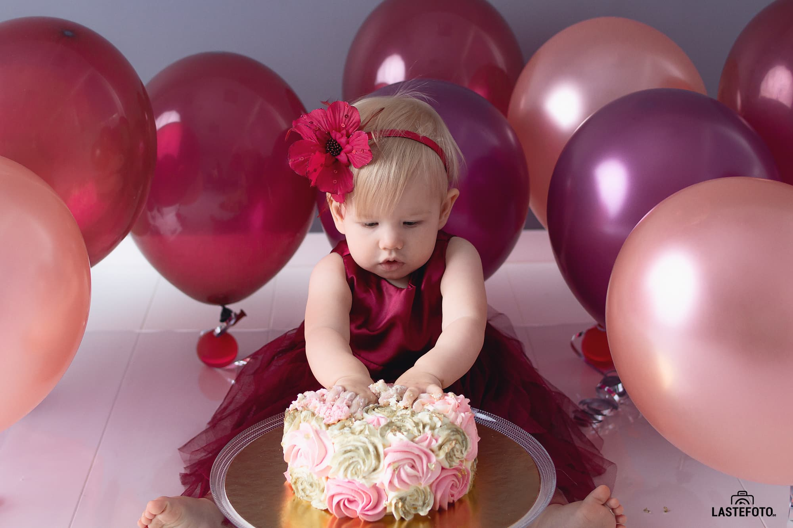
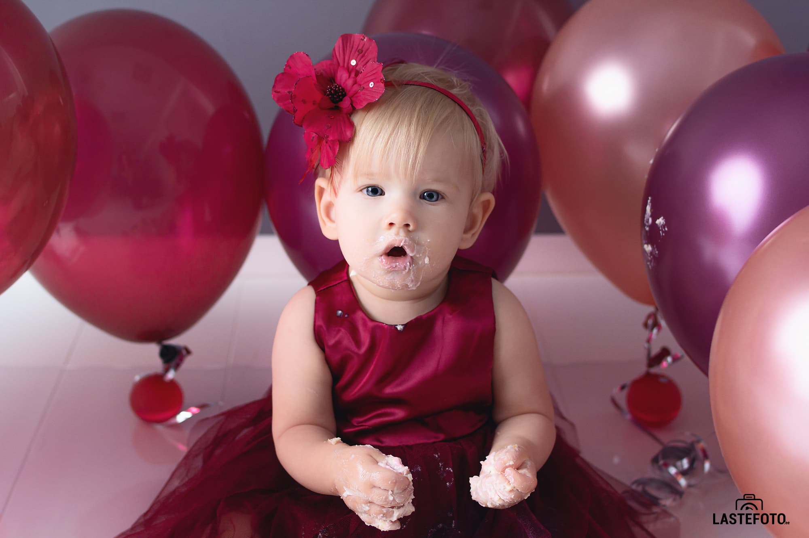
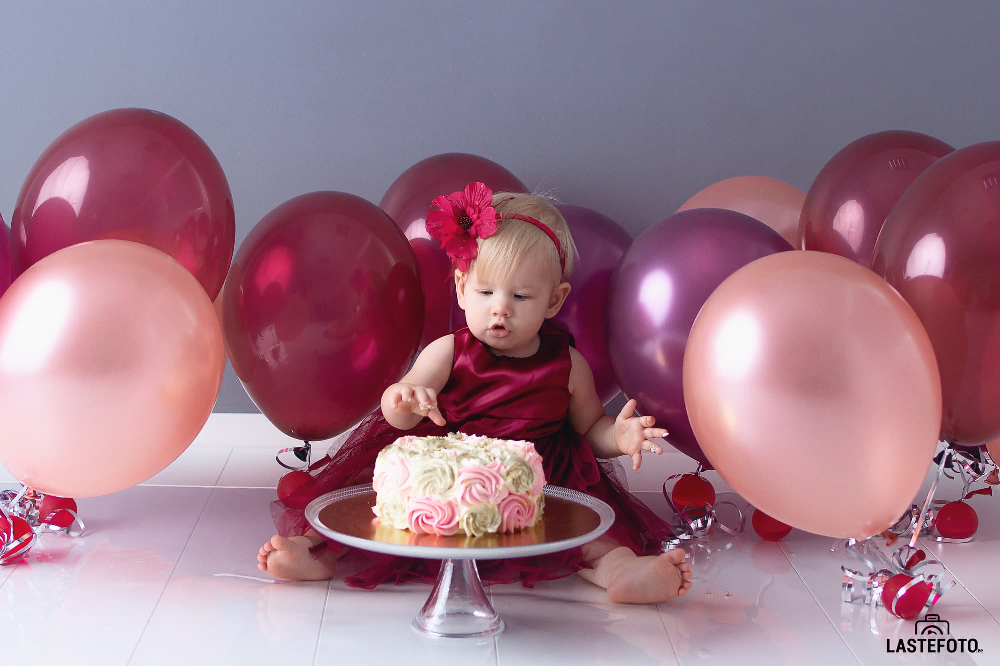

## How funny these "yearlings" are!

I really want to forever leave in my memory their insecure club-footed steps and a look full of delight from the incredible discoveries that happen EVERY TIME in the life of a little person!

That is why, on the first birthday of the baby, many parents choose a thematic **CAKE SMASH** photo shoot! 

Colored glaze on the cheeks, bursting laughter and the opportunity to smear everything around with cake - isn't this happiness for the birthday man?

But this shooting has a couple of nuances that you should know about in advance so that reality does not diverge from your colorful expectations. Now I will tell you about them.

* There are chances that your normally active and inquisitive baby will get scared of the cake.
This is really a big and scary thing. So get ready to join the confectionery wreck with your baby!

* It will be great if you have two sets of clothes with you: one for a dignified and noble family shooting at the beginning and the other - for greasy stains from cream and filling at the end.
* Since photo shoot is a very emotional event, especially if you can smear something on the face and the floor, then it is better not to do it on the birth day itself: the baby may have too many impressions.

* For the same reason, be sure to consider the rhythm of the child's sleep and wakefulness when choosing the time to shoot, so that fatigue does not affect our funny session in any way.
* I myself can take care of a suitable cake. But if you certainly want to bring your own, then consult with me in advance: I will suggest the subtleties that are important for the visual component of the "CAKE SMASH" photo shoot.

Smiles to you, sweet treats and memorable frames! ♥ Sign up for shooting!