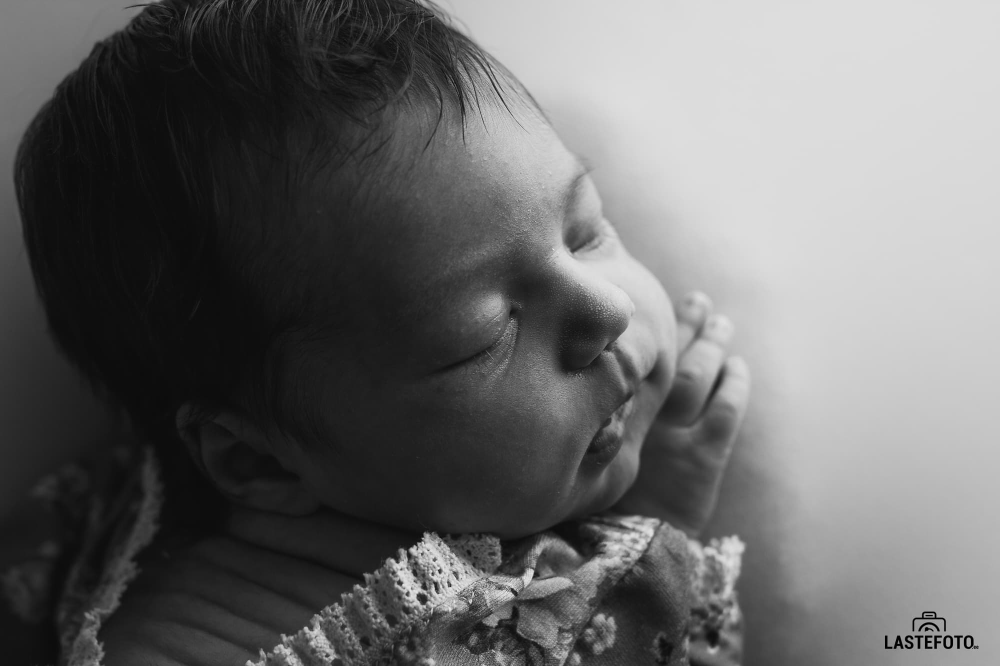
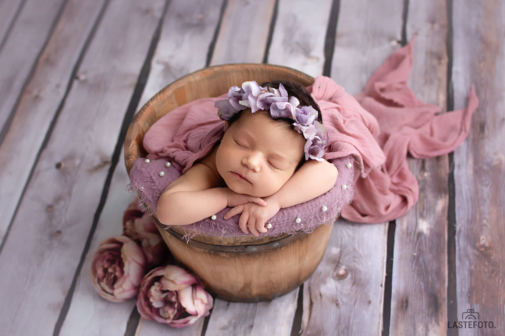
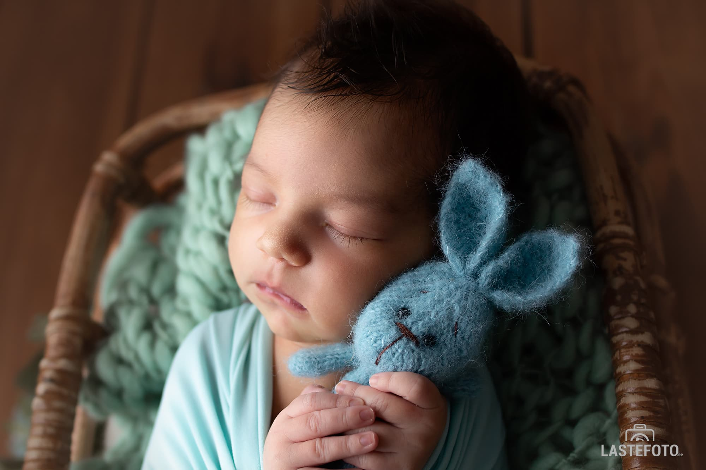

Choosing a photographer for your newborn baby is a very responsible thing. The newborn photography market is developing very quickly and a large number of photographers offer their services.

_How not to be mistaken with the choice?_

After all, you do not just choose a photographer, you choose a specialist who will make a photo shoot professionally and safely for the baby.

- Start looking for your photographer while you are pregnant. When the baby is born, you simply will not have time for this. And the ideal time (4-15 days) for a photo shoot of a newborn passes imperceptibly.

- Choose a photographer who specializes in newborn photography. Browse through the portfolio. If necessary, ask a photographer to show you a series of photo shoots so you can better understand if a particular style of photography is right for you.

- Read reviews from other customers. Ask how long the photographer has specialized in newborn photoshoots, where and from whom he studied.

- Don't choose a photographer based solely on the price of a photo shoot. The price of a newborn photo shoot cannot be low - in addition to the necessary props, which must be purchased and prepared for the photo shoot, a professional newborn photographer must study a lot in order not only to please you with beautiful pictures, but also to ensure the safety of your baby during the photo shoot. Safety is the most important thing in a newborn photo shoot.

Of course, the price of a newborn photo shoot is very important, but don't make it the main criterion.

Choose a photographer for your baby, who will give you pictures, looking at which you will remember how tiny your baby was, how thin his fingers were and how you wanted to kiss his sweet toes. ❤️