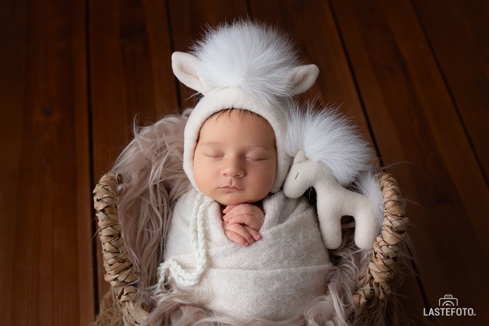
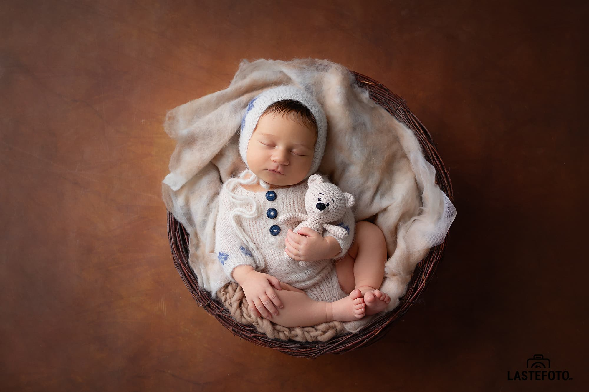

I have already written about the most appropriate time to shoot a newborn, about the most touching poses ... And today I want to touch on the topic of color.

Before the newborn session, parents receive a questionnaire from me, one of the points of which is the choice of the color in which the newborn photo shoot will take place. I have fifteen of them to choose from, both for boys and girls.

It would seem that everything is simple: the color of my husband's favorite football team is red, I also always liked this color: energetic, bright ... take it!

BUT.
Will scarlet pictures fit into the interior of your home?
And if the baby was born with a distinctly reddish skin tone, are you sure you want to further accentuate it with items of clothing and props? Or, nevertheless, on the contrary, is it better to level this redness with green?

There are such subtleties that you cannot immediately think of.
But now that you know about them, what color would you choose? Classic blue/pink? Or something more extravagant?

