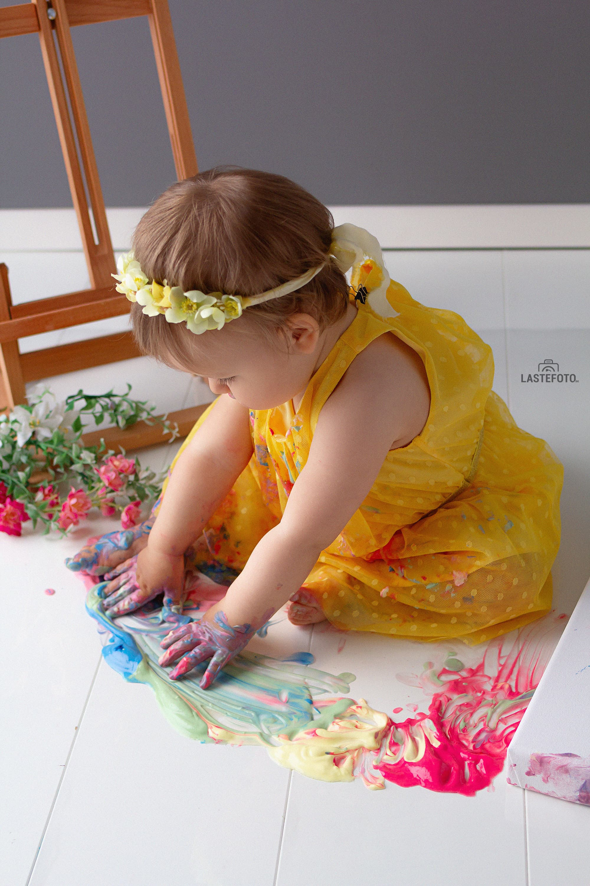

Does your kid create delicious beet puree streaks on the walls and is passionate about drawing?
Then the photo shoot **Young Abstract Artist** with canvas and edible colors is what you need to unleash the potential of your genius!

- Bright, juicy shots
- Fast photo shoot (will end before the onset of the creative crisis)
- Canvas with a masterpiece - as a gift

Although this type of photo shoot is an absolute novelty in Tallinn, I have already managed to shoot enough to reveal interesting patterns.

## As with the “Cake Smash!” photo shoot, not all kids immediately take to the “dirty” business. And that's okay.

All people need time to adapt to a new space, and small ones especially.

! photo shoot with colors in Tallinn](./photosession-with-ediable-colors-3.jpg)

I always take this time with a margin, and also take into account additional breaks for drinking-eating-peeing. So, if anything goes wrong, do not worry, we will definitely have time for everything, even if the baby does not immediately grab the paint.

! photo shoot with colors](./photosession-with-ediable-colors-4.jpg)

## Surprisingly but not all kids love getting dirty.
Just yesterday I had a little princess on the session, who didn't want to get her sweet fingers dirty.

! photo shoot with colors in Tallinn](./photosession-with-ediable-colors-5.jpg)

But we found a way out. We painted with all available means: a spoon, a toy hammer, a bagel with poppy seeds and even a piece of cardboard were used. And the result is great!

So do not worry if something does not go according to the intended scenario: impromptu, as a rule, is even more interesting!

! photo shoot with colors in Tallinn](./photosession-with-ediable-colors-7.jpg)

Tell us if your children like to be smeared with something? What did they wash from for the longest time? Markers, huh?

