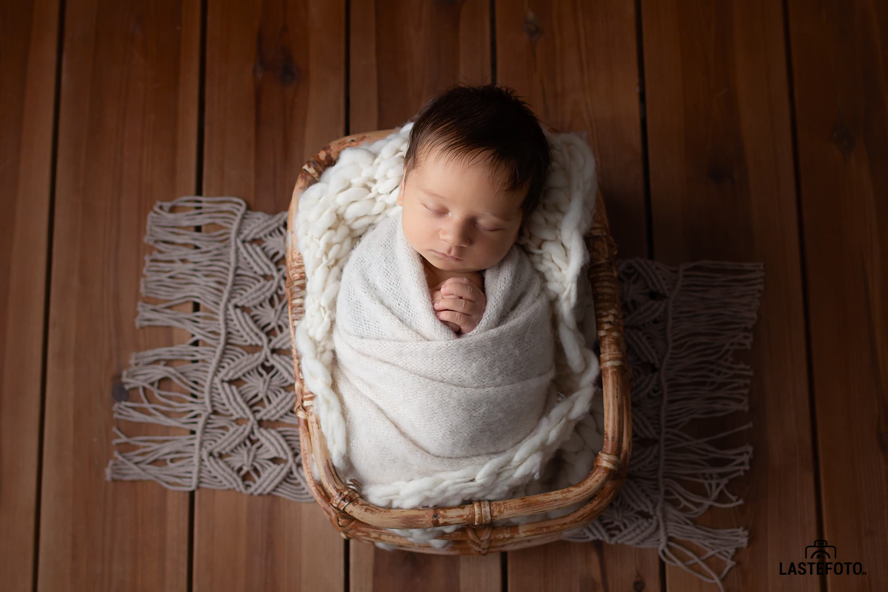

Rääkisin juba beebi fotosessiooni kõige sobivamaks ajast, kõige armsatest poosidest... Ja täna tahan puudutada värvi teemat.

Enne beebifotosessiooni saavad vanemad minult küsimustiku, mille üheks punktiks on värvi valimine, milles fotosessioon toimub. Mul on umbes 15 värvi, mille hulgast saate valida.

Näib, et kõik on lihtne: abikaasa lemmiku jalgpalli meeskonna värv - punane, ka mulle alati meeldis see värv: energiline, särav ... valime selle!

AGA. 

Kas roospunased pildid sobivad teie maja interjööri? Ja kui beebi sündis punaka nahatooniga, kas olete kindel, et soovite seda rõivaste ja rekvisiidide abil veelgi rõhutada? Või on parem seda punetust rohelisega tasandada?

Need on sellised peensused, millistest te isegi ei mõtle. Aga nüüd, kui te neist teate, mis värvile teie valik langeks? Kas jääte truuks klassikale? Või valite julgemad/ekstravagantsemad värvid?

