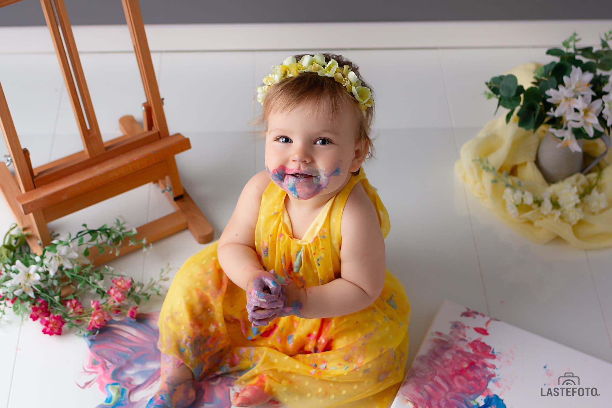

Kas teie beebi loob seintele veetlevaid plekke peedipüree abiga ega ole joonistamise suhtes ükskõikne?
Siis fotosessioon **Noor abstraktsionist** lõuendi ja söödavate värvidega - on just see, mis on vaja teie väikese geeniuse potentsiaali näitamiseks.

* Eredad, mahlased pildid
* Kiire fotosessioon (lõpeb enne loomingulise kriisi algust)
* Lõuend teie beebi meistriteosega - kingituseks

Kuigi seda tüüpi fotosessioon on Tallinnas absoluutne uudsus, on mul juba õnnestunud piisavalt pildistada, et teha huvitavaid järeldusi.

# Nagu “Cake smash!” fotosessioonil, ei tee kõik lapsed kohe «räpaseid» asju. Ja see on okei.

Kõik inimesed vajavad uue ruumi ja inimesega kohanemiseks aega, eriti väikesed.

Võtan seda aega alati varuga ja võtan arvesse ka lisapause joomiseks-söömiseks-pissimiseks. Seega, ärge muretsege, meil on kindlasti aega kõigeks, isegi kui laps kohe värvi ei haara.

# Üllatavalt, aga mitte kõik lapsed armastavad määrduda. Just eile oli mul fotosessioon väikse printsessiga, kes ei tahtnud oma magusaid sõrmi määrida.

Kuid leidsime lahenduse. Maalisime kõigi võimalike vahenditega: kasutatud oli lusikas, mänguasjahaamer, sõõrik mooniseemnetega ja isegi tükk pappi. Ja tulemus on suurepärane!

Seetõttu ärge muretsege, kui midagi ei lähe kavandatud stsenaariumi järgi: eksprompt on reeglina veelgi huvitavam!

