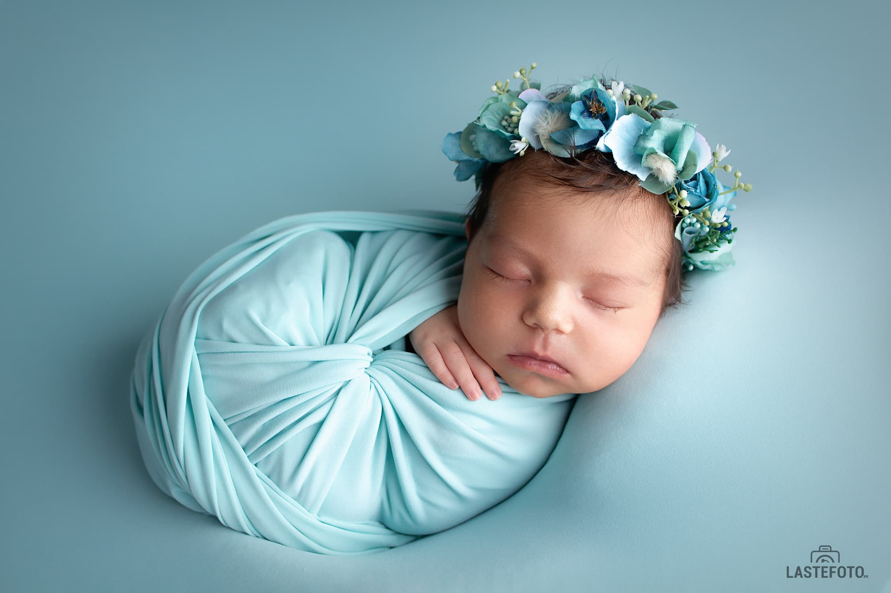
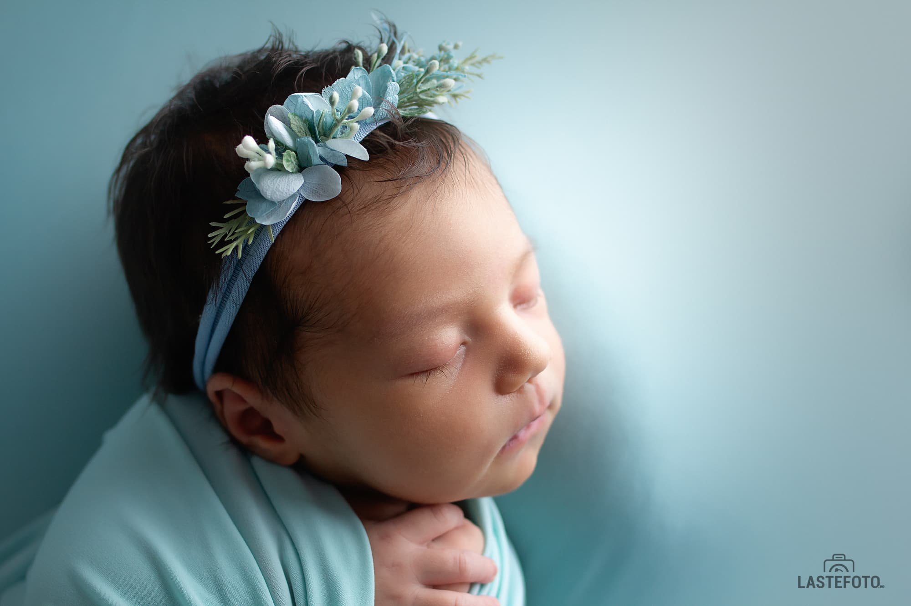

Vastsündinu fotograafi valimine - on päris oluline asi. Vastsündinu pildistamise turg kasvab väga kiiresti ja vastsündinu fotograafe on väga palju. Kuidas teha õige valiku?
Teie mitte lihtsalt valite fotograafi, teie valite spetsialisti, kes professionaalselt ja turvaliselt pildistab teie beebi.

* Alusatge fotograafi otsingut olles beebiootel. Kui beebi sünnib, teil ei ole selleks lihtsalt aega. Ja vastsündinu fotosessiooniks ideaalne periood (4-15 päevi) jookseb nähtamatult.

* Valige fotograafi, kes spetsialiseerub vastsündinu pildistamisel. Vaadake portfoolio läbi. Kui vajalik, küsige fotograafi näidata ühe sessiooni seeriat, nii saate paremini aru kas antud pildistamise stiil sobib teile või mitte.

* Lugege teiste kliente arvamusi. Küsige kui kaua fotograaf vastsündinuid pildistab, kus ja kelle juures õppis.

* Ärge valige fotograafi, baseerudes ainult vastsündinu fotosessiooni hinnal. Vastsündinu fotosessiooni hind ei saa madal olla - peale vajaliku rekvisiidi, mis on vaja osta ja fotosessiooniks ette valmistada, professionaalne vastsündinu fotograaf õpib erinevatel kallidel workshop'idel, et mitte ainult rõõmustada teid ilusate piltidega vaid tagada teie beebi turvalisust fotosessiooni ajal. Turvalisus - on kõige olulisem vastsündinu fotosessioonil. Fotosessiooni hind on muidugi väga tähtis, aga ärge tehke seda peamiseks kriteeriumiks.

Valige fotograafi, kes kingib pilte, mille peale vaadates, saate meenutada kui pisike teie beebi oli, millised peenikesed sõrmed  ja magusad varbad tal olid. ❤️