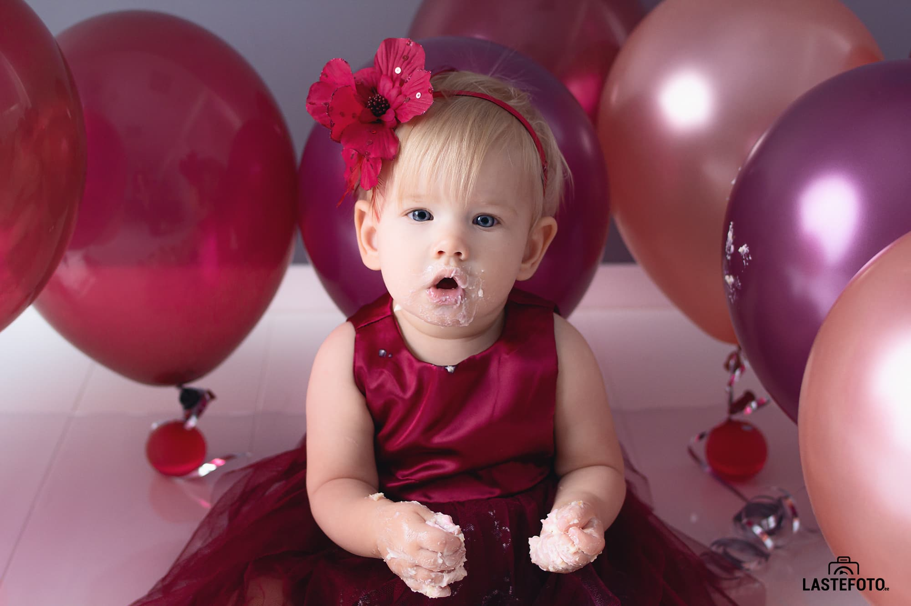

## Какие они забавные эти "годовасики"! 

Очень хочется навсегда оставить в памяти их неуверенные косолапые шажочки и взгляд, полный восторга от невероятных открытий, которые ЕЖЕСЕКУНДНО случаются в жизни маленького человека! 

Именно поэтому, на первый День Рождения малыша многие родители выбирают тематическую фотосессию **CAKE SMASH**! 

Цветная глазурь по щекам, заливистый смех и возможность перемазать тортом все вокруг - это ли не счастье для именинника?

Но у этой съемки есть пару нюансов, о которых стоит знать заранее, чтобы реальность не разошлась с вашими красочными ожиданиями. Сейчас я вам о них расскажу.

- Есть вероятность, что ваш обычно активный и любознательный малыш испугается торта. 
Это, действительно, большая и страшная штука. Так что будьте готовы присоединиться к крушению кондитерского изделия вместе с ребенком! 

- Будет здорово, если у вас будет с собой два комплекта одежды: один для чинной и благородной семейной съемки в начале, а другой - для жирных разводов от крема и начинки в конце.
- Поскольку фотосъемка событие очень эмоциональное, тем более, если можно что-то размазывать по лицу и полу, то лучше ее не делать в сам День Рождения: у малыша может случиться перебор впечатлений. 

- По той же причине обязательно учтите ритм сна и бодрствования ребенка при выборе времени для съемки, чтобы усталость никак не отразилась на наших веселых кадрах.
- Я сама могу позаботиться о подходящем тортике. Но если вы непременно хотите принести свой, то проконсультируйтесь со мной заранее: я подскажу тонкости, которые важны для визуальной составляющей праздничной фотосессии "CAKE SMASH".

Улыбок вам, сладких лакомств и памятных кадров ♥️! Записывайтесь на съемку!