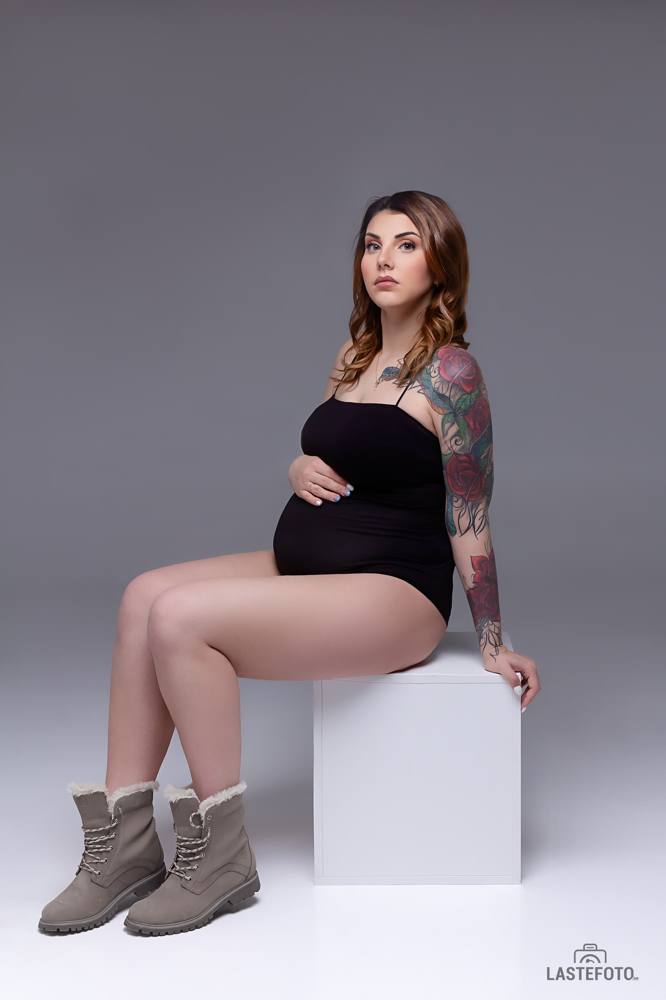
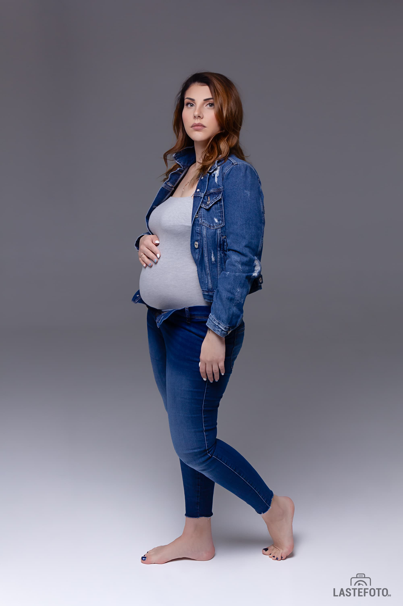

Это о-о-очень красиво: только будущая мама и её животик... 
## Лаконично, стильно, силуэтно. ❤️

Никакой мишуры, отвлекающей от божественных, мягких контуров... 
Я это пишу, а у самой мурашки бегут по коже: для меня, правда, съемка беременности — особенная. 

А если она ещё и в элегантном стиле Vogue, то это просто восторг!

Я записалась на онлайн-обучение к основательнице этого направления, Саше Бунаевой! Эти фотографии сделаны в рамках обучения.

Первое домашнее задание и первые световые схемы. Я довольна ❤️

Это именно тот вид съёмки, от которого я по-настоящему кайфую и который хочу развивать, и предлагать будущим мамочкам. 😍 

Впереди ещё три домашних работы и диплом, но уже сейчас можно бронировать фотосессию в таком направлении. Если это ваша первая беременность, то жду с 20 по 27 неделю.

Будет очень классно, я уже чувствую! ❤