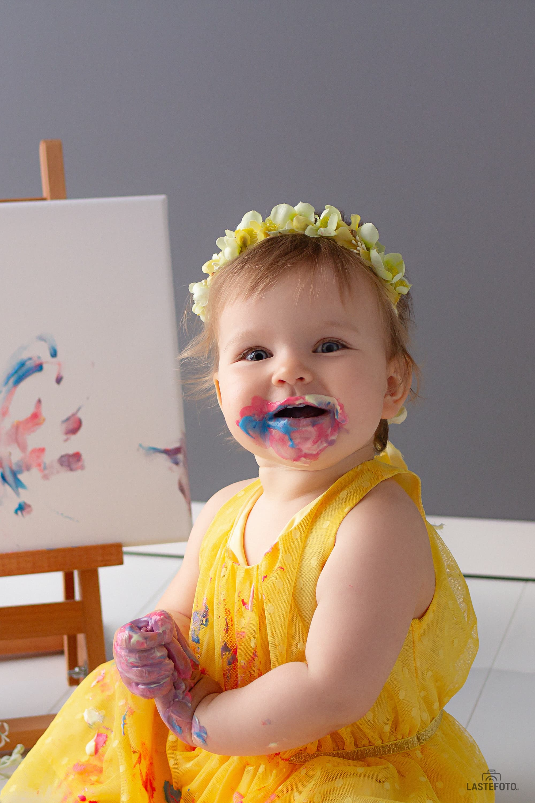

Малыш создаёт восхитительные разводы свекольным пюре на стенах и не равнодушен к рисованию?
Тогда фотосессия **Юный абстракционист** с холстом и съедобными красками - это то, что нужно, чтобы раскрыть потенциал вашего гения!

- Яркие, сочные кадры
- Быстрая съемка (закончится ещё до наступления творческого кризиса)
- Холст с шедевром - вам в подарок

Хотя этот вид фотосессии абсолютная новинка в Таллинне, я уже успела достаточно отснять, чтобы выявить интересные закономерности. 

## Как и в случае с съемкой «Cake smash!», не все детки сразу принимаются за «грязное» дело. И это нормально.

Всем людям нужно время на адаптацию к новому пространству, а маленьким - особенно. 

Я это время всегда беру с запасом, а так же учитываю дополнительные перерывы на попить-поесть-пописать. Так что, если что, не переживайте, мы всё обязательно успеем, даже если малыш не сразу хватается за краски.

## Удивительно, но не все детки любят пачкаться. 
Буквально вчера у меня на съемке была маленькая принцесса, которая ну никак не хотела пачкать свои сладкие пальчики. 

Но мы нашли выход. Мы рисовали всеми подручными средствами: в ход пошла ложка, игрушечный молоточек, баранка с маком и даже кусок картона. И результат получился отличный! 

Поэтому не переживайте, если что-то пойдёт не по задуманному сценарию: экспромты, как правило, ещё интереснее! 

Расскажите, любят ли ваши дети в чем-то измазаться ? От чего отмывали дольше всего? Фломастеры, да?

