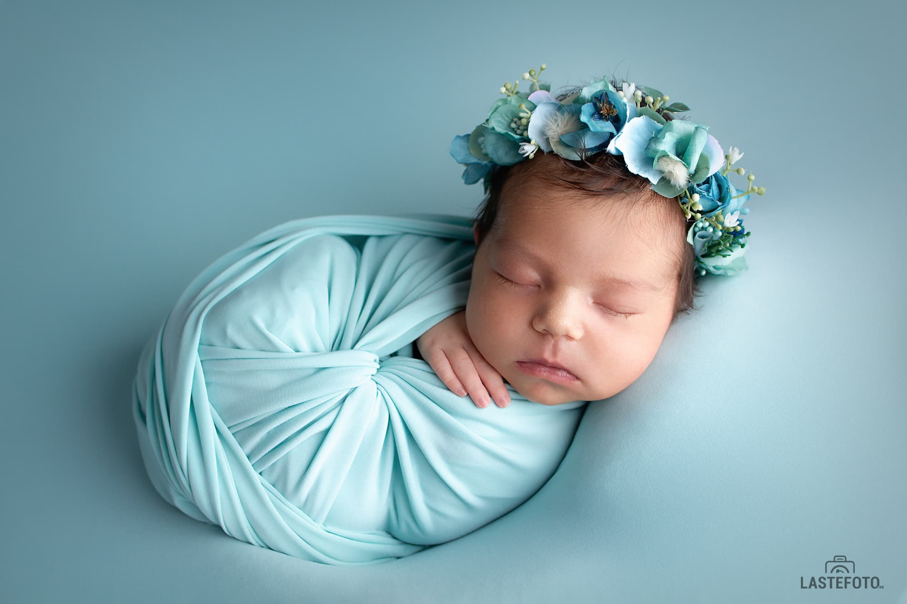
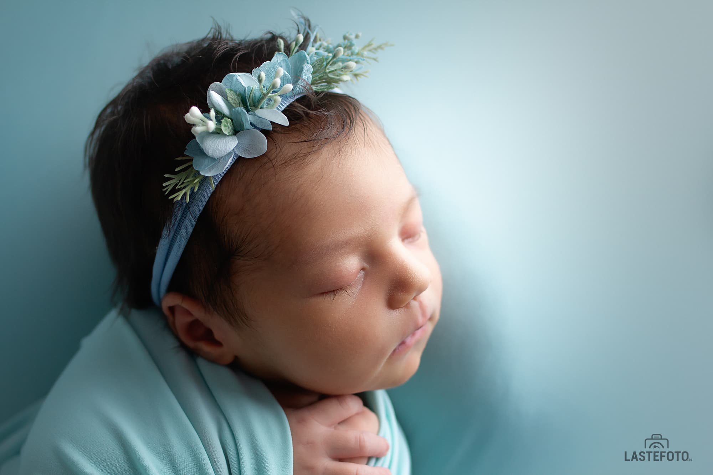
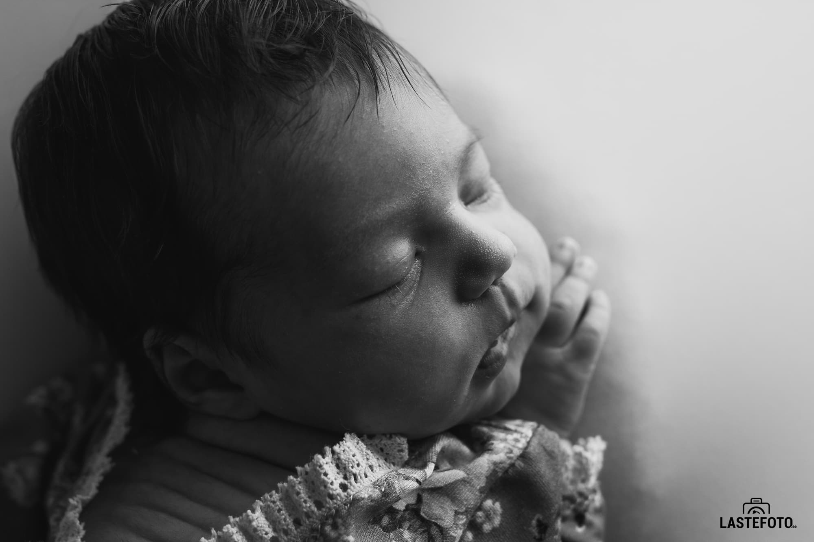
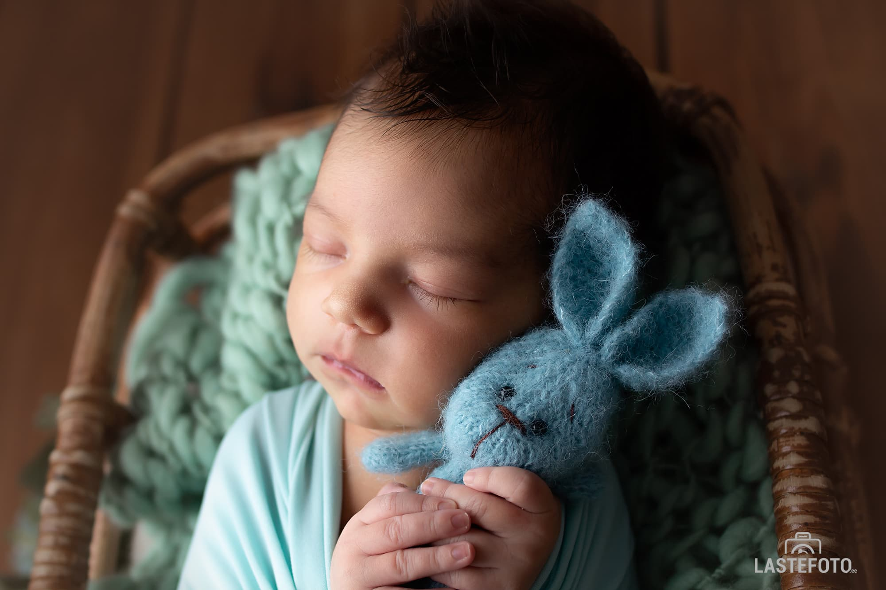

Выбор фотографа для своего малыша - дело очень ответственное. Рынок фотосъемки новорожденных развивается очень быстро и большое количество фотографов предлагают свои услуги. 

_Как не ошибиться с выбором?_ 

Ведь вы не просто выбираете фотографа, вы выбираете специалиста, который профессионально и безопасно для малыша проведет фотосессию.

* Начинайте поиск вашего фотографа еще во время беременности. Когда малыш родится, у вас просто не будет на это времени. А идеальный срок (4-15 дней) для фотосессии новорожденного проходит незаметно.

* Выбирайте фотографа, который специализируется на фотосессиях новорожденных. Просмотрите портфолио. При необходимости попросите фотографа показать серию фотографий, чтобы вы могли лучше понять, подходит ли вам тот или иной стиль фотографии.

* Читайте отзывы других клиентов. Спрашивайте как долго фотограф специализируется на фотосессиях новорожденных, где и у кого учился.

* Не выбирайте фотографа, основываясь исключительно по цене фотосессии. Цена фотосессии новорожденного не может быть низкой - помимо необходимого реквизита, который необходимо приобрести и подготовиться к фотосессии, профессиональный фотограф новорожденных обязательно проходит обучение, чтобы не только порадовать вас красивыми снимками, но и обеспечить безопасность вашего малыша во время фотосессии. Безопасность - самое главное в фотосессии новорожденного. 

Конечно, цена фотосессии очень важна, но не делайте ее главным критерием. 

Выбирайте фотографа для своего малыша, который подарит вам снимки, глядя на которые, вы будете вспоминать каким крохотным был ваш малыш, какие тоненькие были у него пальчики на ручках и как хотелось зацеловать сладкие пальчики на ножках. ❤️